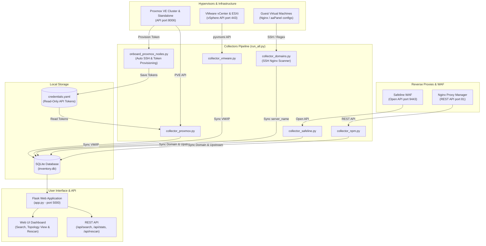

# 📡 Domain Radar

> **Multi-Hypervisor & Reverse Proxy Inventory System**  
> *Trace and map web domains, reverse proxies (Safeline WAF / Nginx Proxy Manager), down to backend VMs/LXCs across Proxmox VE & VMware vSphere.*

[](https://www.python.org/)
[](https://flask.palletsprojects.com/)
[](https://www.sqlite.org/)
[](https://www.proxmox.com/)
[](https://www.vmware.com/)
[](LICENSE)

---

## 📌 Why Domain Radar?

In medium to large infrastructure environments spanning dozens of **Proxmox VE** nodes, **VMware vCenter/ESXi** clusters, alongside various **WAFs** and **Reverse Proxies** (such as Chaitin Safeline WAF and Nginx Proxy Manager), tracking the exact origin and route of a domain is often challenging for SysAdmin & DevOps teams:

- *"Which VM is actually hosting `app.example.com`?"*
- *"Is traffic for this domain protected by Safeline WAF or forwarded through Nginx Proxy Manager?"*
- *"Which node is the proxy VM running on, and which internal IP is the backend web server using?"*
- *"What local or public IPs are assigned to this VM across multi-NIC setups?"*

**Domain Radar** is built to answer these questions instantly. It automatically discovers infrastructure topology from hypervisors and reverse proxies, stores it in a fast local SQLite database, and presents it in a responsive, interactive Web UI dashboard.

---

## ✨ Key Features

- 🖥️ **Multi-Hypervisor Support**:
  - **Proxmox VE**: Automated hypervisor onboarding via SSH, creation of dedicated read-only `inventory@pve` user (`PVEAuditor` & `AgentMonitor`), automated API token provisioning, VM (QEMU) & Container (LXC) data collection, and multi-NIC local/public IP resolution.
  - **VMware vSphere & ESXi Standalone**: Uses `pyvmomi` to securely and automatically retrieve all VMs across vCenter clusters and standalone ESXi hosts.
- 🛡️ **Reverse Proxy & WAF Discovery**:
  - **Chaitin Safeline WAF**: Open API integration (v6.6.0+) to read protected domains with target backend upstream IPs and ports.
  - **Nginx Proxy Manager (NPM)**: REST API integration (JWT token authentication) to extract all proxy hosts, domain lists, and forward configurations.
- 🔍 **Direct Web Server Inspection**:
  - Automatic SSH inspection of Nginx and aaPanel configuration files to parse `server_name` directives.
  - Supports `manual_overrides` for isolated VMs or DMZ hosts without direct SSH access.
- 🔗 **End-to-End Topology Tracing**:
  - Connects the entire flow: `Domain` ➔ `WAF / Proxy Host` ➔ `Backend VM` ➔ `Hypervisor Node & VMID`.
  - Supports exact domain matching and wildcard patterns (`*.domain.com`).
- ⚡ **Lightweight Web UI & REST API**:
  - Clean web dashboard with animated radar graphic, instant search, category filters (All, Safeline WAF, Nginx Proxy Manager, Direct Web), and status cards.
  - One-click **Rescan** feature with real-time progress banner and mode selection (Full scan vs Quick scan).
  - REST API endpoints (`/api/search`, `/api/stats`, `/api/rescan`, `/api/rescan/status`) ready for custom integration.
- 🔄 **One-Command Pipeline & Automation**:
  - Unified pipeline scripts (`run_all.py`, `run_all.bat`, `run_all.ps1`, `run_all.sh`) with `--skip-ssh` and `--serve` options.

---

## 🏗️ System Architecture



---

## 📁 Directory Structure

```text
domain-radar/
├── app.py                      # Flask Application (Web UI, REST API & Rescan Worker)
├── collector_domains.py        # Guest VM Domain Scanner via SSH (Nginx & aaPanel)
├── collector_npm.py            # Nginx Proxy Manager Collector (REST API)
├── collector_proxmox.py        # Proxmox VE Collector (VM/LXC & IP extraction)
├── collector_safeline.py       # Chaitin Safeline WAF Collector (Open API)
├── collector_vmware.py         # VMware vCenter & ESXi Standalone Collector (pyvmomi)
├── config.example.yaml         # Configuration template
├── config.yaml                 # Active configuration (DO NOT commit to Git)
├── credentials.yaml            # Proxmox token credentials (auto-generated, DO NOT commit)
├── db/
│   └── schema.sql              # SQLite schema (proxmox_vms & domain_map)
├── init_db.py                  # SQLite database initialization & WAL configuration
├── inventory.db                # SQLite database storing scanned inventory
├── onboard_proxmox_nodes.py    # Automated SSH onboarding for new Proxmox hosts
├── requirements.txt            # Python dependencies
├── run_all.bat                 # One-click runner for Windows Command Prompt
├── run_all.ps1                 # Runner script for Windows PowerShell
├── run_all.py                  # Main cross-platform Python pipeline runner
├── run_all.sh                  # Shell script runner for Linux / macOS (cron-friendly)
└── templates/
    └── index.html              # Web Dashboard with live radar graphics & rescan control
```

---

## 🚀 Installation & Setup Guide

### 1. Prerequisites
- Python 3.9 or newer
- Network connectivity to:
  - Proxmox VE hosts (API port 8006, SSH port 22 for one-time onboarding)
  - VMware vCenter / ESXi (HTTPS port 443)
  - Safeline WAF (HTTPS port 9443)
  - Nginx Proxy Manager (HTTP/HTTPS port 81)
  - Guest VMs reachable via SSH (port 22)

### 2. Clone Repository & Setup Virtual Environment
```bash
# Clone repository
git clone https://github.com/username/domain-radar.git
cd domain-radar

# Create virtual environment
python -m venv venv

# Activate virtual environment
# On Linux / macOS:
source venv/bin/activate
# On Windows PowerShell:
.\venv\Scripts\Activate.ps1
# On Windows Command Prompt:
.\venv\Scripts\activate.bat

# Install dependencies
pip install -r requirements.txt
```

### 3. Initialize Database
Initialize the SQLite database schema:
```bash
python init_db.py
```
*(Or manually via SQLite CLI: `sqlite3 inventory.db < db/schema.sql`)*

---

## ⚙️ Configuration (`config.yaml`)

Copy the configuration template:
```bash
cp config.example.yaml config.yaml
```

Edit `config.yaml` to match your infrastructure:

```yaml
database_path: "inventory.db"

# 1. Proxmox VE Hosts
# Fill SSH information here. API tokens are generated AUTOMATICALLY by onboard_proxmox_nodes.py
# and stored securely in credentials.yaml (read-only PVEAuditor role).
proxmox_hosts:
  - name: "pve-node-01"
    api_host: "10.0.0.1"          # Host/IP for API access (port 8006)
    ssh_host: "10.0.0.1"          # Host/IP for initial SSH onboarding
    ssh_user: "root"
    ssh_key_path: "~/.ssh/id_rsa_inventory"
    ssh_port: 22
    verify_ssl: false

# 2. Default SSH Credentials for Scanning Virtual Hosts on Guest VMs
ssh_default:
  user: "root"
  key_path: "~/.ssh/id_rsa_inventory"
  port: 22
  timeout: 8

# 3. Chaitin Safeline WAF Instances (Open API)
safeline_hosts:
  - local_ip: "10.0.5.10"         # VM/LXC IP hosting Safeline
    api_base: "https://10.0.5.10:9443"
    api_token: "YOUR_SAFELINE_API_TOKEN" # From Safeline System Management menu

# 4. Nginx Proxy Manager Instances (REST API)
npm_hosts:
  - local_ip: "10.0.5.15"         # VM/LXC IP hosting NPM
    api_base: "http://10.0.5.15:81"
    username: "admin@example.com"
    password: "your_npm_password"
    verify_ssl: false

# 5. VMware vCenter / ESXi Standalone Hosts
vmware_hosts:
  # vCenter Cluster (automatically gathers all VMs from all connected ESXi nodes)
  - name: "vcenter-cluster"
    host: "10.0.0.10"
    user: "readonly-user@vsphere.local"
    password: "your_vcenter_password"
    port: 443
    verify_ssl: false
  # Standalone ESXi Node (optional)
  - name: "esxi-standalone"
    host: "192.168.1.50"
    user: "root"
    password: "your_esxi_password"
    port: 443
    verify_ssl: false

# 6. Manual Overrides (Optional)
# For isolated VMs without SSH access where domain mappings should be tracked manually
manual_overrides:
  - domain: "internal-service.local"
    source_type: "nginx"
    found_on_ip: "10.10.5.20"
```

---

## 🚦 Usage Workflow

### Step 1: Onboard Proxmox Nodes (Run Once)
Connects via SSH once to each Proxmox host to create the dedicated read-only user `inventory@pve` (`PVEAuditor` & `AgentMonitor` roles) and generates API tokens:
```bash
python onboard_proxmox_nodes.py
```
> [!NOTE]
> Tokens are securely saved into `credentials.yaml`. After this initial step, **subsequent scans do not require SSH to the Proxmox hypervisors**, communicating solely through the Proxmox REST API.

### Step 2: Run the Data Collection Pipeline
Execute the complete inventory pipeline with a single command:

```bash
# Run all collection steps
python run_all.py

# Fast Mode: Skip guest VM SSH scans (syncs Proxmox, VMware, Safeline, NPM)
python run_all.py --skip-ssh

# Auto-Serve Mode: Launch Web UI automatically after sync completes
python run_all.py --serve
```

**Or use platform-specific runners:**
- **Windows (CMD)**: `run_all.bat`
- **Windows (PowerShell)**: `.\run_all.ps1`
- **Linux / macOS**: `./run_all.sh`

### Step 3: Launch Web Dashboard
```bash
python app.py
```
Open your browser and navigate to:  
👉 **`http://localhost:5000`** (or `http://YOUR-SERVER-IP:5000`)

### 🔐 Web UI Authentication & Dynamic Password Management
By default, access to the Web UI dashboard and REST API is protected with password authentication:
- **Default Username**: `admin`
- **Default Password**: `adminpassword`

Credentials and password hashes are stored dynamically in the SQLite database (`inventory.db` in table `auth_users`).

**Settings Gear Button (⚙️)**:
On the dashboard header, click the gear icon button next to the theme toggle:
- 🔑 **Change password**: Open a popup dialog to change your password dynamically on-the-fly without restarting the service or editing configuration files.
- 🚪 **Logout**: Immediately terminate your active session and redirect to the login page.

You can also seed or customize initial credentials in `config.yaml`:
```yaml
auth:
  enabled: true
  username: "admin"
  password: "YOUR_STRONG_PASSWORD"   # Seed credentials for initial setup
  session_secret: "YOUR_SECRET_KEY"  # Flask session secret key
  session_lifetime_days: 7           # Session validity period
```

> **Tip**: You can also override credentials via environment variables:  
> `DOMAIN_RADAR_AUTH_USER="admin" DOMAIN_RADAR_AUTH_PASS="your_password" python app.py`

---

## ⏰ Automation & Scheduling (Cron / Task Scheduler)

To keep inventory data updated continuously, schedule the runner periodically:

### Using Crontab (Linux)
```bash
chmod +x /opt/domain-radar/run_all.sh
crontab -e
```
Add the following line to synchronize every hour:
```cron
0 * * * * cd /opt/domain-radar && ./run_all.sh >> /var/log/domain-radar-sync.log 2>&1
```

### Running Web UI as a Systemd Service (Linux)
Create `/etc/systemd/system/domain-radar.service`:
```ini
[Unit]
Description=Domain Radar Web Dashboard
After=network.target

[Service]
Type=simple
User=www-data
WorkingDirectory=/opt/domain-radar
ExecStart=/opt/domain-radar/venv/bin/python /opt/domain-radar/app.py
Restart=always
RestartSec=5

[Install]
WantedBy=multi-user.target
```
Enable and start the service:
```bash
sudo systemctl daemon-reload
sudo systemctl enable --now domain-radar
```

---

## 🔒 Security Guidelines

Before publishing this repository to public or private Git remotes, ensure no credentials or internal databases are committed:

1. **Verify `.gitignore` includes**:
   - `config.yaml` *(contains internal IPs and passwords)*
   - `credentials.yaml` *(contains Proxmox API tokens)*
   - `inventory.db` *(contains internal VM, IP, and domain topologies)*
   - `scan.log`
2. **If files were accidentally tracked locally**, untrack them before pushing:
   ```bash
   git rm --cached config.yaml credentials.yaml inventory.db
   git commit -m "chore: remove sensitive configuration and local database from git tracking"
   ```
3. **Principle of Least Privilege**:
   - Proxmox user uses the read-only **`PVEAuditor`** role (cannot create, alter, or delete VMs).
   - VMware accounts should be granted **Read-Only** vSphere permissions.

---

## 🔌 REST API Documentation

Domain Radar provides REST API endpoints for automation and integration:

### 1. Domain Search
- **Endpoint**: `GET /api/search?domain=<query>`
- **Example Request**: `GET /api/search?domain=api.example.com`
- **Example Response**:
  ```json
  [
    {
      "domain": "api.example.com",
      "source_type": "safeline",
      "is_proxy": true,
      "proxy_type": "safeline",
      "proxy_vm": {
        "proxmox_host": "pve-node-01",
        "node": "pve-node-01",
        "vmid": 105,
        "name": "safeline-waf-prod",
        "vm_type": "lxc",
        "local_ip": "10.0.5.10",
        "public_ip": "103.x.x.x",
        "status": "running"
      },
      "backend_ip": "10.0.10.45",
      "backend_port": "8080",
      "backend_vm": {
        "proxmox_host": "vcenter-cluster",
        "node": "esxi-compute-02",
        "vmid": 2041,
        "name": "api-backend-app",
        "vm_type": "vmware",
        "local_ip": "10.0.10.45",
        "public_ip": null,
        "status": "running"
      }
    }
  ]
  ```

### 2. Inventory Statistics
- **Endpoint**: `GET /api/stats`
- **Example Response**:
  ```json
  {
    "total_vms": 128,
    "total_domains": 452,
    "safeline_domains": 210,
    "npm_domains": 180,
    "safeline_proxy_vms": 2,
    "npm_proxy_vms": 3,
    "total_proxy_vms": 5
  }
  ```

### 3. Trigger Rescan
- **Endpoint**: `POST /api/rescan` (or `GET /api/rescan`)
- **Body (JSON)**: `{"skip_ssh": false}` (optional)
- **Example Response**:
  ```json
  {
    "status": "started",
    "message": "Rescan initiated.",
    "skip_ssh": false
  }
  ```

### 4. Rescan Status
- **Endpoint**: `GET /api/rescan/status`
- **Example Response**:
  ```json
  {
    "is_running": true,
    "status": "running",
    "current_step": "Collect Proxmox VM/LXC & IP Data (Local & Public)",
    "step_index": 3,
    "total_steps": 7,
    "duration": 4.2,
    "error": null,
    "skip_ssh": false
  }
  ```

---

## 🛠️ Technical Notes & Considerations

- **QEMU VM IP Detection**: Requires `qemu-guest-agent` installed and running inside guest VMs for network reporting to Proxmox VE.
- **LXC Container IP Detection**: Utilizes Proxmox API `/interfaces` (PVE ≥ 7.3) with fallback to `net0` interface configuration parsing.
- **VMware IP Detection**: Requires VMware Tools installed on guest OS for `guest.ipAddress` and `guest.net` property population.
- **Safeline WAF**: Verified with Safeline Community/Enterprise Open API ≥ 6.6.0.
- **Nginx Proxy Manager**: Uses standard `/api/nginx/proxy-hosts` endpoint.

---

## 🤝 Contributing

Contributions are welcome! Please open an Issue or submit a Pull Request to:
- Add collectors for additional hypervisors (e.g., OpenStack, Harvester, Nutanix AHV).
- Add collectors for other reverse proxies (e.g., Traefik, Caddy, Kong, Cloudflare Tunnels).
- Improve dashboard visualization or query performance.

---

## 📄 License

This project is licensed under the [MIT License](LICENSE).
