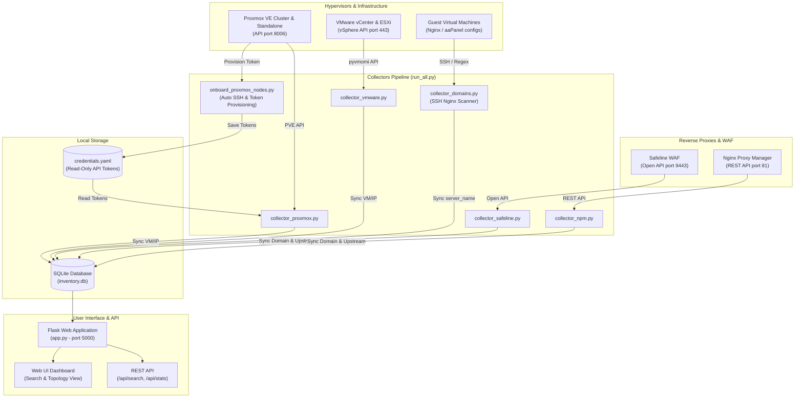

# 📡 Domain Radar

> **Multi-Hypervisor & Reverse Proxy Inventory System**  
> *Lacak dan petakan domain web, reverse proxy (Safeline WAF / Nginx Proxy Manager), hingga ke VM/LXC di Proxmox VE & VMware vSphere.*

[](https://www.python.org/)
[](https://flask.palletsprojects.com/)
[](https://www.sqlite.org/)
[](https://www.proxmox.com/)
[](https://www.vmware.com/)
[](LICENSE)

---

## 📌 Mengapa Domain Radar?

Di infrastruktur berskala menengah hingga besar dengan puluhan host **Proxmox VE**, cluster **VMware vCenter/ESXi**, serta berbagai **WAF** dan **Reverse Proxy** (seperti Chaitin Safeline WAF dan Nginx Proxy Manager), melacak asal-usul sebuah domain sering kali menjadi mimpi buruk tim SysAdmin / DevOps:

- *"Domain `app.perusahaan.com` ini sebenarnya di-hosting di VM mana?"*
- *"Apakah traffic domain ini diproteksi oleh Safeline WAF atau diteruskan oleh Nginx Proxy Manager?"*
- *"VM proxy-nya berada di node mana, dan backend web server-nya berjalan di IP lokal mana?"*
- *"VM ini memiliki IP publik atau IP lokal apa saja di lingkungan multi-NIC?"*

**Domain Radar** dibangun untuk menjawab pertanyaan-pertanyaan tersebut secara instan. Tool ini secara otomatis mengumpulkan data topologi infrastruktur dari hypervisor dan reverse proxy, menyimpannya dalam basis data SQLite lokal, dan menyediakannya dalam antarmuka Web UI yang interaktif dan cepat.

---

## ✨ Fitur Utama

- 🖥️ **Multi-Hypervisor Support**:
  - **Proxmox VE**: Onboarding otomatis hypervisor via SSH, pembuatan user `inventory@pve` dengan peran read-only (`PVEAuditor`), pembuatan API Token otomatis, pengumpulan data VM (QEMU) dan Container (LXC), serta resolusi IP lokal/publik multi-NIC.
  - **VMware vSphere & ESXi Standalone**: Menggunakan `pyvmomi` untuk menarik seluruh daftar VM lintas cluster vCenter dan host ESXi standalone secara aman dan otomatis.
- 🛡️ **Reverse Proxy & WAF Discovery**:
  - **Chaitin Safeline WAF**: Integrasi Open API (v6.6.0+) untuk membaca daftar domain terlindungi beserta target upstream IP dan port backend.
  - **Nginx Proxy Manager (NPM)**: Integrasi REST API (autentikasi JWT token) untuk mengekstrak seluruh proxy host, domain list, dan forward scheme/port.
- 🔍 **Direct Web Server Inspection**:
  - Scan otomatis file konfigurasi web server Nginx dan aaPanel via SSH untuk membaca direktif `server_name`.
  - Mendukung `manual_overrides` untuk VM atau host yang berada di balik DMZ/firewall tanpa akses SSH.
- 🔗 **End-to-End Topology Tracing**:
  - Menghubungkan alur: `Domain` ➔ `WAF / Proxy Host` ➔ `Backend VM` ➔ `Hypervisor Node & VMID`.
  - Mendukung pencarian domain presisi maupun wildcard (`*.domain.com`).
- ⚡ **Lightweight Web UI & REST API**:
  - Web UI modern dengan visual radar animasi, pencarian instan, filter kategori (All, Safeline WAF, Nginx Proxy Manager, Direct Web), dan status cards.
  - Endpoint REST API (`/api/search`, `/api/stats`) siap diintegrasikan dengan tooling internal lainnya.
- 🔄 **One-Command Pipeline & Automation**:
  - Script pipeline terpadu (`run_all.py`, `run_all.bat`, `run_all.ps1`, `run_all.sh`) untuk menjalankan sinkronisasi berurutan dengan opsi `--skip-ssh` dan `--serve`.

---

## 🏗️ Arsitektur Sistem



---

## 📁 Struktur Direktori

```text
domain-radar/
├── app.py                      # Aplikasi Flask (Web UI & REST API pencarian)
├── collector_domains.py        # Scanner domain via SSH ke VM guest (Nginx & aaPanel)
├── collector_npm.py            # Collector Nginx Proxy Manager (REST API)
├── collector_proxmox.py        # Collector Proxmox VE (VM/LXC & IP extraction)
├── collector_safeline.py       # Collector Chaitin Safeline WAF (Open API)
├── collector_vmware.py         # Collector VMware vCenter & ESXi Standalone (pyvmomi)
├── config.example.yaml         # Template konfigurasi sistem
├── config.yaml                 # Konfigurasi aktif (JANGAN di-commit ke Git)
├── credentials.yaml            # Kredensial token Proxmox (auto-generated, JANGAN di-commit)
├── db/
│   └── schema.sql              # Skema tabel SQLite (proxmox_vms & domain_map)
├── init_db.py                  # Script inisialisasi & migrasi database SQLite
├── inventory.db                # Database SQLite hasil scan (JANGAN di-commit)
├── onboard_proxmox_nodes.py    # Auto-onboarding host Proxmox baru via SSH
├── requirements.txt            # Daftar pustaka dependency Python
├── run_all.bat                 # Runner satu-klik untuk Windows Command Prompt
├── run_all.ps1                 # Runner untuk Windows PowerShell
├── run_all.py                  # Runner utama Python lintas sistem operasi
├── run_all.sh                  # Runner untuk Linux / macOS (cocok untuk Cron)
└── templates/
    └── index.html              # Antarmuka Web Dashboard dengan live radar view
```

---

## 🚀 Panduan Instalasi & Persiapan

### 1. Prasyarat Sistem
- Python 3.9 atau versi yang lebih baru
- Akses jaringan ke:
  - Host Proxmox VE (port 8006 API, port 22 SSH untuk onboarding)
  - VMware vCenter / ESXi (port 443 HTTPS)
  - Safeline WAF (port 9443 HTTPS)
  - Nginx Proxy Manager (port 81 HTTP/HTTPS)
  - VM guest yang dapat di-SSH (port 22)

### 2. Clone Repositori & Setup Virtual Environment
```bash
# Clone repository
git clone https://github.com/username/domain-radar.git
cd domain-radar

# Buat virtual environment
python -m venv venv

# Aktifkan virtual environment
# Di Linux / macOS:
source venv/bin/activate
# Di Windows PowerShell:
.\venv\Scripts\Activate.ps1
# Di Windows Command Prompt:
.\venv\Scripts\activate.bat

# Install dependensi
pip install -r requirements.txt
```

### 3. Inisialisasi Database
Jalankan script inisialisasi database SQLite:
```bash
python init_db.py
```
*(Atau gunakan perintah SQLite CLI: `sqlite3 inventory.db < db/schema.sql`)*

---

## ⚙️ Konfigurasi (`config.yaml`)

Salin template konfigurasi `config.example.yaml` menjadi `config.yaml`:
```bash
cp config.example.yaml config.yaml
```

Buka dan sesuaikan `config.yaml` dengan lingkungan Anda:

```yaml
database_path: "inventory.db"

# 1. Daftar Host Proxmox VE
# Cukup isi info SSH di sini. API token akan dibuat OTOMATIS oleh onboard_proxmox_nodes.py
# dan disimpan terpisah di credentials.yaml (role read-only PVEAuditor).
proxmox_hosts:
  - name: "pve-node-01"
    api_host: "10.0.0.1"          # Host/IP akses API (port 8006)
    ssh_host: "10.0.0.1"          # Host/IP untuk SSH onboarding awal
    ssh_user: "root"
    ssh_key_path: "~/.ssh/id_rsa_inventory"
    ssh_port: 22
    verify_ssl: false

# 2. Kredensial SSH Default untuk Scan Virtual Host di VM Guest
ssh_default:
  user: "root"
  key_path: "~/.ssh/id_rsa_inventory"
  port: 22
  timeout: 8

# 3. Instance Chaitin Safeline WAF (Open API)
safeline_hosts:
  - local_ip: "10.0.5.10"         # IP VM/LXC tempat Safeline berjalan
    api_base: "https://10.0.5.10:9443"
    api_token: "YOUR_SAFELINE_API_TOKEN" # Dari menu System Management Safeline

# 4. Instance Nginx Proxy Manager (REST API)
npm_hosts:
  - local_ip: "10.0.5.15"         # IP VM/LXC tempat NPM berjalan
    api_base: "http://10.0.5.15:81"
    username: "admin@example.com"
    password: "your_npm_password"
    verify_ssl: false

# 5. Host VMware vCenter / ESXi Standalone
vmware_hosts:
  # Cluster vCenter (otomatis menarik semua VM dari semua node ESXi yang terhubung)
  - name: "vcenter-cluster"
    host: "10.0.0.10"
    user: "readonly-user@vsphere.local"
    password: "your_vcenter_password"
    port: 443
    verify_ssl: false
  # Node ESXi Standalone (opsional)
  - name: "esxi-standalone"
    host: "192.168.1.50"
    user: "root"
    password: "your_esxi_password"
    port: 443
    verify_ssl: false

# 6. Manual Overrides (Opsional)
# Untuk VM terisolasi/tanpa akses SSH yang domainnya ingin tetap tercatat
manual_overrides:
  - domain: "internal-service.local"
    source_type: "nginx"
    found_on_ip: "10.10.5.20"
```

---

## 🚦 Alur Penggunaan

### Langkah 1: Onboarding Proxmox Nodes (Hanya Dijalankan Sekali)
Script ini melakukan SSH sekali ke setiap host Proxmox untuk membuat user khusus `inventory@pve` dengan izin audit read-only (`PVEAuditor`) dan menghasilkan API token:
```bash
python onboard_proxmox_nodes.py
```
> [!NOTE]
> Hasil token disimpan secara aman di `credentials.yaml`. Setelah langkah ini selesai, **koneksi rutin ke Proxmox tidak lagi menggunakan SSH**, melainkan langsung menggunakan Proxmox REST API token.

### Langkah 2: Jalankan Pipeline Koleksi Data
Anda dapat menjalankan seluruh pipeline secara otomatis dengan satu perintah:

```bash
# Menjalankan seluruh langkah koleksi
python run_all.py

# Opsi Cepat: Lewati scan SSH ke guest VM (hanya sinkronisasi Proxmox, VMware, Safeline, NPM)
python run_all.py --skip-ssh

# Opsi Auto-Serve: Otomatis menjalankan Web UI setelah sinkronisasi selesai
python run_all.py --serve
```

**Atau gunakan shortcut sesuai OS:**
- **Windows (CMD)**: `run_all.bat`
- **Windows (PowerShell)**: `.\run_all.ps1`
- **Linux / macOS**: `./run_all.sh`

### Langkah 3: Jalankan Web Dashboard
```bash
python app.py
```
Buka browser dan akses:  
👉 **`http://localhost:5000`** (atau `http://IP-SERVER:5000`)

---

## ⏰ Otomasi & Penjadwalan (Cron / Task Scheduler)

Agar data inventaris selalu mutakhir, jadwalkan script runner secara berkala:

### Menggunakan Crontab (Linux)
```bash
chmod +x /opt/domain-radar/run_all.sh
crontab -e
```
Tambahkan baris berikut untuk sinkronisasi setiap jam:
```cron
0 * * * * cd /opt/domain-radar && ./run_all.sh >> /var/log/domain-radar-sync.log 2>&1
```

### Menjalankan Web UI sebagai Systemd Service (Linux)
Buat file service di `/etc/systemd/system/domain-radar.service`:
```ini
[Unit]
Description=Domain Radar Web Dashboard
After=network.target

[Service]
Type=simple
User=www-data
WorkingDirectory=/opt/domain-radar
ExecStart=/opt/domain-radar/venv/bin/python /opt/domain-radar/app.py
Restart=always
RestartSec=5

[Install]
WantedBy=multi-user.target
```
Aktifkan dan jalankan:
```bash
sudo systemctl daemon-reload
sudo systemctl enable --now domain-radar
```

---

## 🔒 Panduan Keamanan (PENTING Sebelum Push ke GitHub)

Sebelum Anda mempublikasikan repositori ini ke GitHub Publik/Privat, **pastikan tidak ada kredensial atau basis data internal yang ter-commit**:

1. **Pastikan file berikut masuk ke `.gitignore`**:
   - `config.yaml` *(berisi IP internal dan password)*
   - `credentials.yaml` *(berisi API token Proxmox)*
   - `inventory.db` *(berisi data seluruh VM, IP, dan domain internal)*
   - `scan.log`
2. **Jika file tersebut terlanjur ter-commit secara lokal**, hapus dari staging git sebelum melakukan `git push`:
   ```bash
   git rm --cached config.yaml credentials.yaml inventory.db
   git commit -m "chore: remove sensitive configuration and local database from git tracking"
   ```
3. **Prinsip Least Privilege**:
   - User Proxmox menggunakan role **`PVEAuditor`** (read-only, tidak dapat memodifikasi atau menghapus VM).
   - User VMware sebaiknya menggunakan akun **Read-Only** vSphere.

---

## 🔌 Dokumentasi REST API

Domain Radar menyediakan endpoint REST API sederhana untuk integrasi otomatisasi:

### 1. Pencarian Domain
- **Endpoint**: `GET /api/search?domain=<query>`
- **Contoh Request**: `GET /api/search?domain=api.contoh.com`
- **Contoh Response**:
  ```json
  [
    {
      "domain": "api.contoh.com",
      "source_type": "safeline",
      "is_proxy": true,
      "proxy_type": "safeline",
      "proxy_vm": {
        "proxmox_host": "pve-node-01",
        "node": "pve-node-01",
        "vmid": 105,
        "name": "safeline-waf-prod",
        "vm_type": "lxc",
        "local_ip": "10.0.5.10",
        "public_ip": "103.x.x.x",
        "status": "running"
      },
      "backend_ip": "10.0.10.45",
      "backend_port": "8080",
      "backend_vm": {
        "proxmox_host": "vcenter-cluster",
        "node": "esxi-compute-02",
        "vmid": 2041,
        "name": "api-backend-app",
        "vm_type": "vmware",
        "local_ip": "10.0.10.45",
        "public_ip": null,
        "status": "running"
      }
    }
  ]
  ```

### 2. Statistik Inventaris
- **Endpoint**: `GET /api/stats`
- **Contoh Response**:
  ```json
  {
    "total_vms": 128,
    "total_domains": 452,
    "safeline_domains": 210,
    "npm_domains": 180,
    "safeline_proxy_vms": 2,
    "npm_proxy_vms": 3,
    "total_proxy_vms": 5
  }
  ```

---

## 🛠️ Catatan Teknis & Batasan

- **Deteksi IP QEMU VM**: Memerlukan `qemu-guest-agent` terpasang dan aktif di dalam VM guest agar IP dapat dilaporkan ke Proxmox VE.
- **Deteksi IP Container LXC**: Menggunakan Proxmox API `/interfaces` (PVE ≥ 7.3) dengan fallback parsing konfigurasi antarmuka `net0`.
- **Deteksi IP VMware**: Memerlukan VMware Tools terpasang pada guest OS agar properti `guest.ipAddress` dan `guest.net` terisi lengkap.
- **Safeline WAF**: Telah diuji pada versi Open API Safeline Community/Enterprise ≥ 6.6.0.
- **Nginx Proxy Manager**: Menggunakan endpoint standard `/api/nginx/proxy-hosts`.

---

## 🤝 Kontribusi

Kontribusi selalu terbuka! Silakan kirimkan Pull Request atau buat Issue untuk:
- Menambahkan collector hypervisor baru (misal: OpenStack, Harvester, Nutanix AHV).
- Menambahkan collector reverse proxy baru (misal: Traefik, Caddy, Kong, Cloudflare Tunnels).
- Peningkatan tampilan dashboard atau optimasi kueri database.

---

## 📄 Lisensi

Proyek ini dilisensikan di bawah [MIT License](LICENSE).
